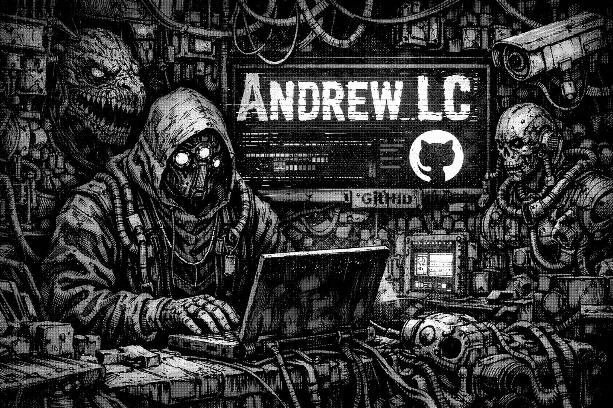

  
  

  <h2>👋 Hi, I’m Andrew LC</h2>
  
Software Engineer • Full-Stack • Robotics & Systems

  

---

## 💻 About Me

I’m a **software engineer based in India**, recently graduated in **Software Engineering**.  
I enjoy working across **full-stack development, backend systems, and robotics software**, with a strong preference for understanding systems from first principles.

- 🧠 Interested in **systems programming, robotics, distributed systems, and backend architecture**
- 🤖 Actively working with **ROS 2, Gazebo, and robot simulation**
- 📚 Enjoy **books, manga, and anime**
- 📖 Currently reading **_Crafting Interpreters_ by Robert Nystrom**
- 🔍 I value deep understanding over surface-level usage

---

## ⚙️ Tech Stack & Tools

### Programming Languages

  &nbsp;
  &nbsp;
  &nbsp;
  &nbsp;
  &nbsp;
  &nbsp;
  &nbsp;

### Frontend

  &nbsp;
  &nbsp;
  &nbsp;
  &nbsp;
  &nbsp;

### Backend, Databases & Messaging

  &nbsp;
  &nbsp;
  &nbsp;
  &nbsp;

### Robotics & Simulation (ROS)

  &nbsp;
  &nbsp;

- **ROS 2 (Humble / Jazzy)**
- **Gazebo / Ignition**
- URDF, TF2, RViz
- Robot kinematics (FK / IK), controllers, simulation pipelines

### DevOps & Tooling

  &nbsp;
  &nbsp;
  &nbsp;
  &nbsp;

---

## 🚀 Areas of Interest

- Systems programming & performance-critical software
- Robotics software engineering & simulation
- Distributed systems & backend services
- Clean architecture and maintainable codebases

---

## 📫 Connect With Me

- 💼 LinkedIn: [Andrew Lamichhane](https://www.linkedin.com/in/andrew-lamichhane-34a397219)
- 🐦 Twitter: [@azeus333](https://twitter.com/azeus333)

---

⭐ Feel free to explore my repositories and see what I’m building.
